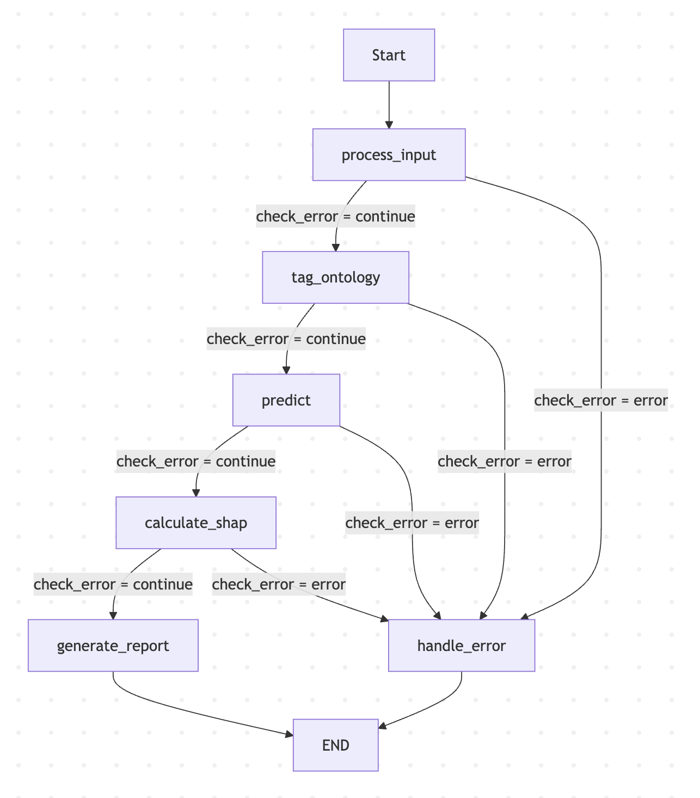

# kcd2025 Team-J

## ML 기반 발관 예측 모델의 예측도 향상을 위한 LLM 피드백 에이전트 (LLM Feedback Agent for Improving the Predictive Performance)

LangGraph와 ML 모델을 활용한 AI 기반 기계환기 발관(Extubation) 실패 예측 및 환자 보호자용 설명 레포트 생성 시스템


## 프로젝트 개요
이 시스템은 중환자실(ICU) 환자의 기계환기 발관 실패 가능성을 예측하고, 의료진과 보호자가 이해하기 쉬운 설명 레포트를 자동으로 생성합니다.

### 주요 기능

- **환자 데이터 처리**: 환자의 임상 데이터를 수집하고 전처리
- **의료 온톨로지 태깅**: LLM을 활용하여 발관 실패와 관련된 위험 요인 자동 태깅
- **ML 기반 예측**: 사전 학습된 XGBoost 모델을 사용한 발관 실패 확률 예측
- **SHAP 분석**: 각 임상 지표가 예측에 미치는 영향도 분석
- **보호자용 레포트 생성**: LLM을 활용하여 비전문가도 이해하기 쉬운 설명 레포트 자동 생성

## 시스템 아키텍처

LangGraph를 사용한 워크플로우:



```
사용자 입력 → 데이터 처리 → 온톨로지 태깅 (LLM) → ML 예측 (XGBoost) → SHAP 분석 → 레포트 생성 (LLM)
```

### 워크플로우 단계

1. **process_input**: 환자 데이터 검증 및 전처리
2. **tag_ontology**: LLM을 사용한 의료 온톨로지 기반 위험 요인 태깅
3. **predict**: XGBoost 모델을 사용한 발관 실패 확률 예측
4. **calculate_shap**: SHAP 값 계산 및 특성 중요도 분석
5. **generate_report**: LLM을 사용한 환자 보호자용 설명 레포트 생성

## AI 에이전트 기반 Ontology Feature 생성

### 개요

본 시스템의 핵심 혁신은 **LLM 에이전트를 활용한 동적 의료 온톨로지 특성(Ontology Feature) 생성**입니다. 기존의 정적인 특성 엔지니어링과 달리, 의료 전문 지식을 갖춘 LLM이 각 환자의 임상 데이터를 실시간으로 분석하여 발관 실패 위험 요인의 중요도를 자동으로 평가합니다.

### 작동 원리

#### 1. 의료 온톨로지 특성 정의

시스템은 10가지 임상적으로 검증된 발관 실패 위험 요인을 평가합니다:

- `obesity_importance`: 비만 (BMI 기반)
- `advanced_age_importance`: 고령 (AGE 기반)
- `male_sex_importance`: 남성 성별
- `high_fraction_of_inspired_oxygen_importance`: 높은 흡입산소농도 (FiO2 기반)
- `diabetes_mellitus_history_importance`: 당뇨병력 (DM 기반)
- `acidosis_importance`: 산증 (pH, PACO2 기반)
- `anemia_importance`: 빈혈 (HB 기반)
- `elevated_blood_urea_nitrogen_importance`: 높은 혈중요소질소 (BUN 기반)
- `tachycardia_importance`: 빈맥 (HR 기반)
- `low_mean_arterial_pressure_importance`: 낮은 평균동맥압 (MAP 기반)

#### 2. LLM 에이전트 태깅 프로세스

**입력**: 환자의 모든 임상 데이터 (활력징후, 검사 수치, 기저질환 등)

**프롬프트 설계**:
```
너는 중환자실 전문의이자 임상 데이터 전문가야.
환자 데이터를 분석하여 각 위험 요인이 발관 실패 예측에
얼마나 중요한지 판단해줘.

응답 규칙:
- 매우 중요하거나 중요한 경우: 1
- 중요하지 않거나 관련이 없는 경우: 0
```

**출력**: 각 온톨로지 특성에 대한 이진 중요도 값 (0 또는 1)

**LLM 설정**:
- Model: MedGemma 27B (의료 전문 모델)
- Temperature: 0.3 (일관성 있는 평가)
- Response Format: JSON (구조화된 출력)

#### 3. Feature 통합 및 ML 모델 입력

LLM이 생성한 10개의 온톨로지 특성은 원본 임상 데이터(37개 특성)와 결합되어 총 **48개의 특성**으로 구성된 feature matrix를 생성합니다. 이 확장된 특성 집합은 XGBoost 모델의 입력으로 사용됩니다.

### 기술적 이점

#### 1. 의료 지식의 자동화
- 임상 전문가의 판단 과정을 AI로 자동화
- 복잡한 임상 지표 간의 상호작용 고려
- 환자별 맞춤형 위험 요인 평가

#### 2. 모델 성능 향상
- 단순 수치 데이터를 의료 맥락으로 변환
- 임상적으로 의미 있는 특성 생성
- ML 모델의 예측 정확도 개선

#### 3. 확장성 및 유연성
- 새로운 온톨로지 특성 추가 용이
- 다양한 의료 전문 LLM 활용 가능
- 프롬프트 수정을 통한 평가 기준 조정

### 예시

**환자 데이터**:
```json
{
  "AGE": 75,
  "BMI": 32.5,
  "FIO2": 0.6,
  "pH": 7.25,
  "HB": 8.5,
  "DM": 1
}
```

**LLM 평가 결과**:
```json
{
  "obesity_importance": 1,           // BMI 32.5 → 비만
  "advanced_age_importance": 1,      // AGE 75 → 고령
  "high_fraction_of_inspired_oxygen_importance": 1,  // FiO2 60% → 높음
  "acidosis_importance": 1,          // pH 7.25 → 산증
  "anemia_importance": 1,            // HB 8.5 → 빈혈
  "diabetes_mellitus_history_importance": 1  // DM=1 → 당뇨
}
```

이러한 온톨로지 특성은 ML 모델이 단순 수치를 넘어 **임상적 의미**를 이해하도록 돕습니다.

## 설치 방법

### 필수 요구사항

- Python 3.8 이상
- OpenAI API 호환 엔드포인트 (또는 로컬 LLM 서버)

### 패키지 설치

```bash
pip install -r requirements.txt
```

### 필요한 패키지

- `langgraph>=0.0.20`: 워크플로우 관리
- `pandas>=2.0.0`: 데이터 처리
- `numpy>=1.24.0`: 수치 연산
- `shap>=0.42.0`: 모델 설명 가능성 분석
- `scikit-learn>=1.3.0`: 머신러닝 전처리
- `openai>=1.0.0`: LLM API 호출
- `xgboost>=2.0.0`: 예측 모델

## 사용 방법

### 1. 사전 학습된 모델 준비

`./models/best_model_medgemma.pkl` 경로에 사전 학습된 XGBoost 모델 파일이 필요합니다.

### 2. API 설정

`demo_extubation_prediction_graph_medgemma_ver3.py` 파일에서 OpenAI 클라이언트 설정을 수정하세요:

```python
# Line 103, 354
client = OpenAI(base_url="your_endpoint_url", api_key="your_api_key")
```

### 3. 프로그램 실행

```bash
python demo_extubation_prediction_graph_medgemma_ver3.py
```

### 4. 환자 데이터 입력

코드 내 예시 데이터를 수정하거나, `get_user_input()` 함수를 활성화하여 대화형으로 입력할 수 있습니다.

## 입력 데이터 형식

시스템에 입력해야 하는 환자 데이터 필드:

### 기본 정보
- `AGE`: 나이
- `SEX`: 성별 (M/F)
- `BMI`: 체질량지수
- `VENT_DUR`: 기계환기 기간

### 기저질환
- `CHF`: 울혈성 심부전
- `CVD`: 심혈관 질환
- `CPD`: 만성 폐질환
- `CKD`: 만성 신장 질환
- `CLD`: 만성 간질환
- `DM`: 당뇨병
- `CRRT`: 지속적 신대체요법

### 활력징후
- `CVP`: 중심정맥압
- `MAP`: 평균동맥압
- `HR`: 심박수
- `RR`: 호흡수
- `BT`: 체온
- `SPO2`: 산소포화도
- `GCS`: 글래스고 혼수 척도

### 혈액가스 및 검사 수치
- `PH`, `PACO2`, `PAO2`, `HCO3`: 혈액가스 분석
- `LACTATE`: 젖산
- `WBC`, `HB`, `PLT`: 혈액 검사
- `SODIUM`, `POTASSIUM`, `CHLORIDE`: 전해질
- `BUN`, `CR`: 신기능
- `TB`, `PT`: 간기능/응고

### 인공호흡기 설정
- `FIO2`: 흡입산소농도
- `PEEP`: 호기말양압
- `PPLAT`: 고원압
- `TV`: 일회환기량

### 온톨로지 특성 (LLM이 자동 태깅)
- `obesity_importance`: 비만 중요도
- `advanced_age_importance`: 고령 중요도
- `male_sex_importance`: 남성 성별 중요도
- `high_fraction_of_inspired_oxygen_importance`: 높은 FiO2 중요도
- `diabetes_mellitus_history_importance`: 당뇨병력 중요도
- `acidosis_importance`: 산증 중요도
- `anemia_importance`: 빈혈 중요도
- `elevated_blood_urea_nitrogen_importance`: 높은 BUN 중요도
- `tachycardia_importance`: 빈맥 중요도
- `low_mean_arterial_pressure_importance`: 낮은 MAP 중요도

## 출력 결과

### 1. 예측 결과
- 발관 실패 확률 (0-1 범위)
- 예측 클래스 (0: 성공 예상, 1: 실패 예상)
- 임계값: 0.3 (30% 이상이면 실패 예상)

### 2. SHAP 분석
- 각 특성의 예측 기여도
- 상위 5개 위험 요인

### 3. 보호자용 레포트
- 환자 상태 요약
- AI 예측 결과 해석
- 주요 위험 요인 상세 설명
- 의료진 권고사항

## 모델 정보

### 사용 LLM
- **Tagging Model**: MedGemma 27B (의료 온톨로지 태깅)
- **Generation Model**: MedGemma 27B (레포트 생성)

지원 모델:
- `gpt-oss-20b`
- `hari-q3`
- `medgemma-27b-text-it`

### ML 모델
- **알고리즘**: XGBoost (Gradient Boosting)
- **모델 파일**: `./models/best_model_medgemma.pkl`
- **설명 가능성**: SHAP (SHapley Additive exPlanations)

## 주요 특징

### 1. LangGraph 기반 워크플로우
- 각 단계별 에러 처리
- 조건부 엣지를 통한 유연한 흐름 제어
- 상태 기반 데이터 관리

### 2. 설명 가능한 AI
- SHAP 값을 통한 예측 근거 제시
- 각 임상 지표의 기여도 정량화

### 3. 의료 커뮤니케이션 최적화
- 전문 용어를 일반인이 이해할 수 있는 표현으로 자동 변환
- 따뜻하고 공감적인 어조의 레포트 생성
- 환자 보호자의 의사결정 지원

## 프로젝트 구조

```
kcd2025/
├── demo_extubation_prediction_graph_medgemma_ver3.py  # 메인 프로그램
├── requirements.txt                                    # 패키지 의존성
├── models/
│   └── best_model_medgemma.pkl                        # 사전 학습된 XGBoost 모델
└── README.md                                          # 프로젝트 문서
```


## 멤버!
- 김윤규
- 김도연
- 김동준
- 이택상
- 임예제
- 조채은
- 조형민
